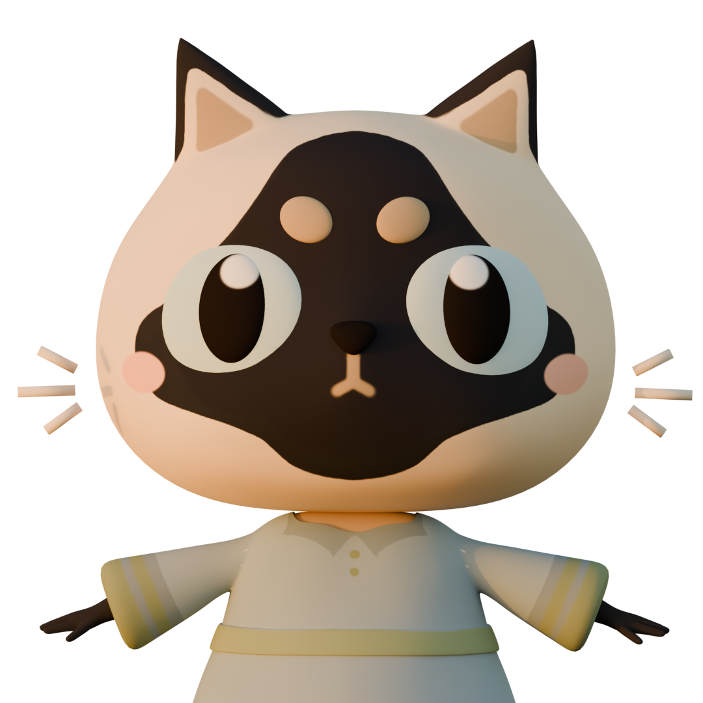

# 🚀 Portfolio Website

Welcome to my **interactive personal website**! This project showcases my skills, projects, and contact information using **React, Three.js, and React Three Fiber**. It features an interactive 3D room with a custom-designed cat character and environment. The cat moves dynamically based on user interactions, creating an engaging and immersive experience.

## 🖥️ Live Demo

Click [here](https://www.sofia-pham.com) for the live website!

## ✨ Features

- 🌎 **Single Page Navigation** – Smooth routing powered by `react-router-dom`
- 🎨 **Modern UI Design** – Styled with **Tailwind CSS** for a clean, responsive, and visually appealing layout
- 🐱 **Interactive Cat Movement** – Click on one of four areas to move the cat to different parts of the room, each with unique animations
- 🏠 **3D Cat and Room Environment** – A personally designed 3D cat and room (with a mix of original and pre-existing assets), assembled and optimized in **Blender**
- 🎮 **Three.js & React Three Fiber** – Integrates 3D models, animations, and interactive camera controls
- 🌀 **Smooth Animations with React Three/Drei** – Adds realistic physics, effects, and transitions
- ⚡ **Optimized Performance** – Efficient rendering and animations using **React Spring** and optimized 3D assets

## 🛠️ Tech Stack

- **Frontend**: React, React Router, Tailwind CSS
- **3D Graphics**: Three.js, React Three Fiber
- **Animations & Effects**: React Three Fiber, React Spring
- **State Management**: React Hooks
- **Build Tool**: Vite
- **3D Modeling & Design**: Blender

## 📌 How It Works

### 🖥️ Navigation

The **Navbar** provides seamless navigation across different sections of the website, including About Me, Projects, and Contact.

### 🐱 Cat Movement

The screen is divided into four interactive areas. Clicking on the floating bubbles moves the cat to specific areas in the 3D room, each with its own unique animation:

- **Stage 1**: Waving animation
- **Stage 2**: Typing animation
- **Stage 3**: Idling animation
- **Stage 4**: Sitting animation

### 🏠 3D Environment

The 3D room is a combination of **original assets** (created in Blender) and **pre-existing assets**:

- **Custom Cat Character**: Designed and animated in Blender to fit the theme of the portfolio
- **Room Assembly**: The room layout, textures, and lighting were made, assembled, and optimized in Blender
- **Physics & Effects**: Realistic lighting, shadows, and animations powered by React Three Fiber and React Spring

#### ✍️ TODO

- Optimize 3D assets to shorten load time
- Detect WebGL/graphics acceleration on browsers

### 🙏 Acknowledgments

- Three.js and React Three Fiber for enabling 3D web experiences
- Blender for empowering me to create custom 3D assets
- Tailwind CSS for making styling efficient and enjoyable
- [Mixamo](https://www.mixamo.com/) for animations on rigged models
- [Poly Pizza](https://poly.pizza/) for pre-existing assets:
  - Fiddle-leaf Plant by Poly by Google [CC-BY](https://creativecommons.org/licenses/by/3.0/) via [Poly Pizza](https://poly.pizza/m/2ag6_uuqsnb)
  - Plant - White Pot by Jakers_H [CC-BY](https://creativecommons.org/licenses/by/3.0/) via [Poly Pizza](https://poly.pizza/m/7ig0HcyfT93)
  - tulip 3 by Hugo Gibson [CC-BY](https://creativecommons.org/licenses/by/3.0/) via [Poly Pizza](https://poly.pizza/m/2zT-C10njmX)
  - Daffodil by Poly by Google [CC-BY](https://creativecommons.org/licenses/by/3.0/) via [Poly Pizza](https://poly.pizza/m/2Gw0Pca1YRS)
  - Gaming Computer by Alex Safayan [CC-BY](https://creativecommons.org/licenses/by/3.0/) via [Poly Pizza](https://poly.pizza/m/5cN7W4ufoII)
  - Computer mouse by Poly by Google [CC-BY](https://creativecommons.org/licenses/by/3.0/) via [Poly Pizza](https://poly.pizza/m/6ikB7PIRVyd)
  - Dual Monitors on sit-stand arm by Pookage Hayes [CC-BY](https://creativecommons.org/licenses/by/3.0/) via [Poly Pizza](https://poly.pizza/m/c9fdvmLhrsT)
  - Keyboard by Poly by Google [CC-BY](https://creativecommons.org/licenses/by/3.0/) via [Poly Pizza](https://poly.pizza/m/aPwr5p1dluw)
  - Desk speakers by jeremy [CC-BY](https://creativecommons.org/licenses/by/3.0/) via [Poly Pizza](https://poly.pizza/m/eKyOw4k5_dW)
  - Vase by Poly by Google [CC-BY](https://creativecommons.org/licenses/by/3.0/) via [Poly Pizza](https://poly.pizza/m/flynTOOHK_z)
  - Water Can by Zoe XR [CC-BY](https://creativecommons.org/licenses/by/3.0/) via [Poly Pizza](https://poly.pizza/m/7EfDXOcziyF)
  - Curtain by J-Toastie [CC-BY](https://creativecommons.org/licenses/by/3.0/) via [Poly Pizza](https://poly.pizza/m/anwvbVovt5)
  - Window Blinds by Alex Safayan [CC-BY](https://creativecommons.org/licenses/by/3.0/) via [Poly Pizza](https://poly.pizza/m/0cXeRYAnxCi)
  - Office Chair by Quaternius via [Poly Pizza](https://poly.pizza/m/UfKvrZBK6C)
  - Dry Erase Board by Jarlan Perez [CC-BY](https://creativecommons.org/licenses/by/3.0/) via [Poly Pizza](https://poly.pizza/m/cgrhoDImyFt)
  - Minimal Marker by Gambsmoore [CC-BY](https://creativecommons.org/licenses/by/3.0/) via [Poly Pizza](https://poly.pizza/m/2k6-ZQ_yxkj)
  - Polaroids by Jarlan Perez [CC-BY](https://creativecommons.org/licenses/by/3.0/) via [Poly Pizza](https://poly.pizza/m/6BgcoF0LL6y)
  - ORIGAMI by Aimi Sekiguchi [CC-BY](https://creativecommons.org/licenses/by/3.0/) via [Poly Pizza](https://poly.pizza/m/djTBk1ul2Ng)
  - Star by Poly by Google [CC-BY](https://creativecommons.org/licenses/by/3.0/) via [Poly Pizza](https://poly.pizza/m/0ddNZ3EsIhw)
  - Piggy bank by Poly by Google[CC-BY](https://creativecommons.org/licenses/by/3.0/) via [Poly Pizza](https://poly.pizza/m/dpvS2kdW6I9)
  - coins by Justin Randall [CC-BY](https://creativecommons.org/licenses/by/3.0/) via [Poly Pizza](https://poly.pizza/m/9vNmQKqqs7Z)
  - Book Stack by Danni Bittman [CC-BY](https://creativecommons.org/licenses/by/3.0/) via [Poly Pizza](https://poly.pizza/m/1WggoIFq8tx)
  - books by Tiff Eidmann [CC-BY](https://creativecommons.org/licenses/by/3.0/) via [Poly Pizza](https://poly.pizza/m/fkPRnm8iSXI)
  - Mazda RX-7 by IvOfficial [CC-BY](https://creativecommons.org/licenses/by/3.0/) via [Poly Pizza](https://poly.pizza/m/SnIoWlh7S2)
  - Cardboard Boxes by Nick Slough [CC-BY](https://creativecommons.org/licenses/by/3.0/) via [Poly Pizza](https://poly.pizza/m/pMdXdrUHvX)
  - Standing lamp by jeremy [CC-BY](https://creativecommons.org/licenses/by/3.0/) via [Poly Pizza](https://poly.pizza/m/7AqWZQIaCQf)
  - Bean Bag by J-Toastie [CC-BY](https://creativecommons.org/licenses/by/3.0/) via [Poly Pizza](https://poly.pizza/m/nMZz79A5ru)
